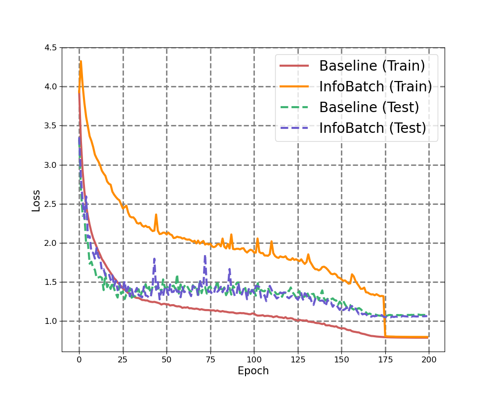

# InfoBatch: Lossless Training Speed Up by Unbiased Dynamic Data Pruning

<a href="https://arxiv.org/abs/2303.04947">
  
</a>

<p align="center">
  
</p>

I provide a README document for easier understanding of my implementation.  
The ```index of this document``` is as follows:

- **How to run?**
- **Experimental settings**  
  - Requirements  
  - H/W specifications  
  - Datasets and Models  
- **Implementation details**
  - InfoBatch
  - Training CIFAR10 / 100
  - InfoBatch hyperparameters
  - Visualize training results
- **Experimental results**
  - CIFAR10 with ResNet-18
  - CIFAR10 with ResNet-50
  - CIFAR100 with ResNet-18
  - CIFAR100 with ResNet-50
    
---

## How to run?

### Run single experiment example
```bash
python train_cifar10.py --seed 0 --gpu 0 --expname ib_cifar10_r18 --use_info_batch --model r18
```

### Run all experiments example
```bash
bash exp_infobatch.sh
```

---

## Experimental Settings
### Requirements
Latest ```PyTorch``` requires Python 3.8 or later.  
You only need ```pytorch```, ```numpy```, ```pickle5``` and ```matplotlib``` to run this code.

### Hardware specifications
```CPU``` : Intel i7-9800X (3.8GHz)  
```GPU``` :  Titan RTX $\times 2$

### Datasets and Models
```Datasets``` : CIFAR-10 / 100  
```Models``` : ResNet-18 / 50

---

## Implementation Details
### InfoBatch
For ```InfoBatch```, during each epoch, it undergoes a process where batches of samples are randomly selected ```without sorting``` and thresholding is applied based on the average of loss values.  
For the samples used in training, the process includes ```updating their score with the loss value```.
Moreover, once a ```certain number of epochs```($\delta \cdot C$) have passed, pruning is no longer performed.  
Instead of implementing a new dataset class, declaring a superclass and wrapping it makes it easier to utilize across various tasks.  
The dataset sampler, in each iteration, exports data in batches based on the soft pruned indices if pruning occurs, or based on all indices otherwise.  
Since the dataset sampler ```randomly selects data at every epoch```, it is crucial to continuously ```track the selected indices``` to update the scores, as each index needs its score updated.  
Code is available in [infobatch.py](infobatch.py).

### Training CIFAR10 / 100
In the classification task, the ```training configuration``` used was as closely aligned as possible with the one detailed by the authors in the paper.  
The ```training configuration``` remains consistent across all experiments, whether using ```CIFAR10``` or ```CIFAR100``` datasets and irrespective of whether the model is ResNet-18 or ResNet-50.  

||Configurations|
|:---:|:---:|
|Initial LR|$0.2$|
|Epochs|200|
|Batch Size|$128$|
|Optimizer| SGD(m=0.9, weight decay=5e-4)|
|Criterion|CrossEntropy(label smoothing=0.1)|
|Scheduler|OneCycleLR|

Codes are available in [train_cifar10.py](train_cifar10.py) for CIFAR-10 and [train_cifar100.py](train_cifar100.py) for CIFAR-100.

### InfoBatch hyperparameters

In the experiments, the term "baseline" refers to the use of the full dataset setting, while "InfoBatch" denotes the modified approach utilizing InfoBatch hyperparameters. For every experiment, the ```InfoBatch hyperparameters``` were set with $r = 0.5$ and $\delta = 0.875$.

### Visualize training results

In the course of my experiments, I meticulously logged several key metrics: the training and test loss for each epoch, as well as the training and test accuracy per epoch. Additionally, I kept a precise record of the training time for all experiments to compare the effectiveness of InfoBatch. All of this information has been systematically saved in the format of pickle files. You can access these results through the provided link: [results](results).  
Furthermore, using the experimental results, I generate Loss/Accuracy per epoch graphs with [visualize_results_cifar10.py](visualize_results_cifar10.py) for CIFAR10 and [visualize_results_cifar100.py](visualize_results_cifar100.py) for CIFAR100.

---

## Experimental Results

### CIFAR-10 Dataset (ResNet-18)

|Method|Best Accuracy (%)|Training Time (Minute)|
|:---:|:---:|:---:|
|Full Dataset|$95.58$|$128.27$|
|InfoBatch|$95.37~(-0.21)$|$81.54~(-46.73)$|

The results show that the training time was reduced from 128.27 minutes to 81.54 minutes, which represents approximately a 36.43% improvement over the baseline.  
The accuracy using the full dataset is 95.58%, and with InfoBatch, the accuracy drops by only about 0.21%.  
I also provide ```Loss / Accuracy``` graph for baseline and InfoBatch training.

<p align="center">
  
  
</p>

### CIFAR-10 Dataset (ResNet-50)

|Method|Best Accuracy (%)|Training Time (Minute)|
|:---:|:---:|:---:|
|Full Dataset|$95.69$|$279.51$|
|InfoBatch|$95.39~(-0.3)$|$179.88~(-99.63)$|

The results show that the training time was reduced from 279.51 minutes to 179.88 minutes, which represents approximately a 35.65% improvement over the baseline.  
The accuracy using the full dataset is 95.69%, and with InfoBatch, the accuracy drops by only about 0.3%.  
I also provide ```Loss / Accuracy``` graph for baseline and InfoBatch training.

<p align="center">
  
  
</p>

### CIFAR-100 Dataset (ResNet-18)

|Method|Best Accuracy (%)|Training Time (Minute)|
|:---:|:---:|:---:|
|Full Dataset|$78.62$|$128.43$|
|InfoBatch|$78.49~(-0.13)$|$88.03~(-40.40)$|

The results show that the training time was reduced from 128.43 minutes to 88.03 minutes, which represents approximately a 31.46% improvement over the baseline.  
The accuracy using the full dataset is 78.62%, and with InfoBatch, the accuracy drops by only about 0.13%.  
I also provide ```Loss / Accuracy``` graph for baseline and InfoBatch training.

<p align="center">
  
  
</p>

### CIFAR-100 Dataset (ResNet-50)

|Method|Best Accuracy (%)|Training Time (Minute)|
|:---:|:---:|:---:|
|Full Dataset|$80.40$|$274.78$|
|InfoBatch|$80.02~(-0.38)$|$191.17~(-83.61)$|

The results show that the training time was reduced from 274.78 minutes to 191.17 minutes, which represents approximately a 30.43% improvement over the baseline.  
The accuracy using the full dataset is 80.40%, and with InfoBatch, the accuracy drops by only about 0.38%.  
I also provide ```Loss / Accuracy``` graph for baseline and InfoBatch training.

<p align="center">
  
  
</p>
